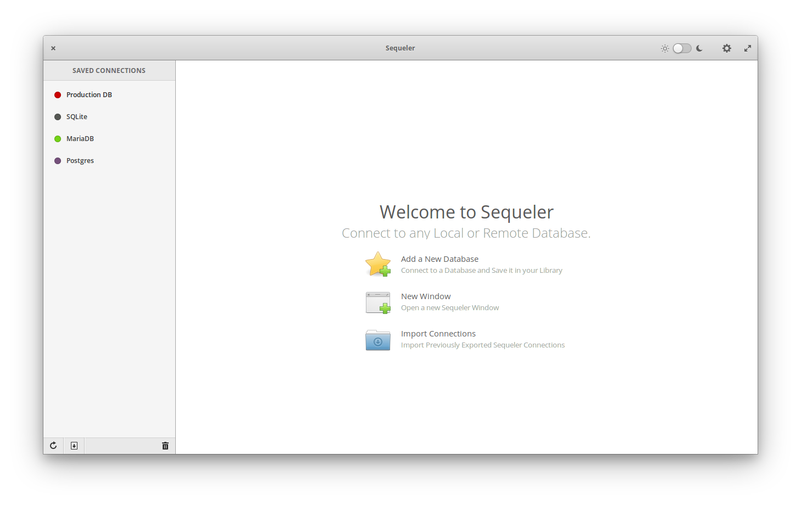

# 
> Friendly SQL Client

[](https://travis-ci.org/Alecaddd/sequeler)

Sequeler is a native Linux SQL client built in Vala and Gtk. It allows you to connect to your local and remote databases, write SQL in a handy text editor with language recognition, and visualize SELECT results in a Gtk.Grid Widget.



## Get it from the elementary OS AppCenter!
Sequeler, is primarily available from the AppCenter of elementary OS. Download it from there!

[](https://appcenter.elementary.io/com.github.alecaddd.sequeler)

## Get it from Flathub!
You can get Sequeler form Flathub no matter what distribution you're using. Download it or follow the instructions to install it from here!

[](https://flathub.org/apps/details/com.github.alecaddd.sequeler)

## Support the Project
If you like Sequeler and you want to support its development, consider donating via [PayPal](https://www.paypal.me/alecaddd) or pledge on [Patreon](https://www.patreon.com/alecaddd).

[](https://www.patreon.com/alecaddd)

## Install it from source
You can install Sequeler by compiling from source, here's the list of dependencies required:
 - `gtk+-3.0>=3.9.10`
 - `granite>=0.5.0`
 - `glib-2.0`
 - `gee-0.8`
 - `gobject-2.0`
 - `libxml-2.0`
 - `libgda-5.0`
 - `gtksourceview-3.0`
 - `libsecret-1`
 - `meson`

## Building
```
meson build --prefix=/usr
cd build
ninja && sudo ninja install
```

